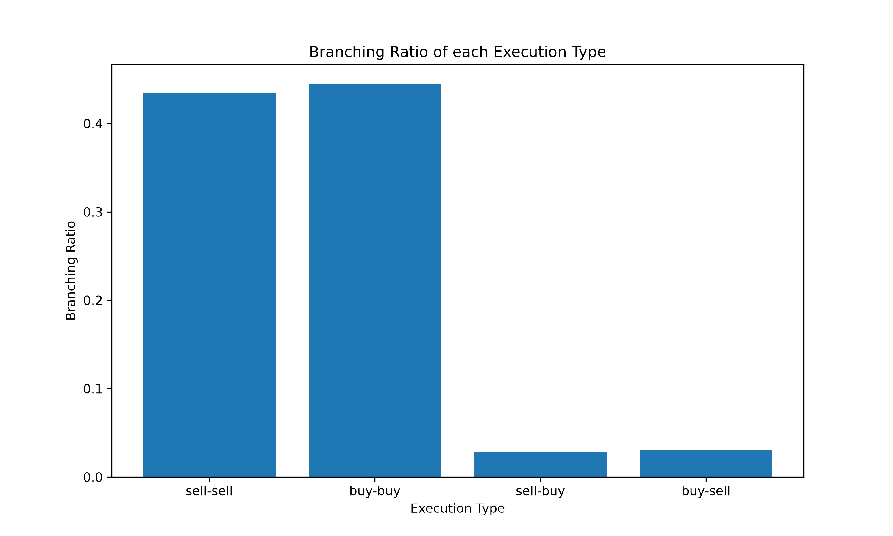
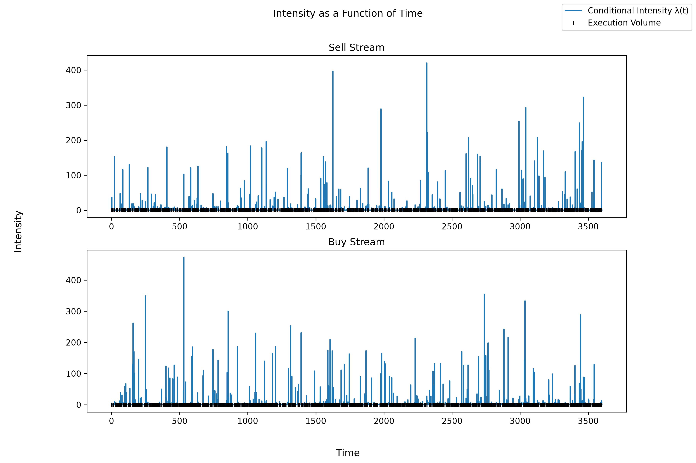
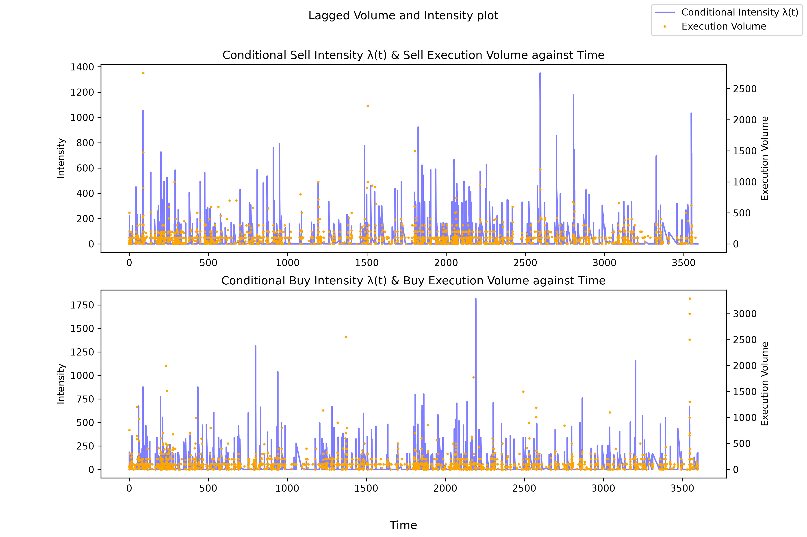

# Hawkes-Approach-to-NASDAQ-Trade-Flow

Using a bivariate, exponential kernel Hawkes process to model data from AAPL message book, ultimately comparing same and cross-side excitation, and evaluating contemporaneous and lagged execution volume to intensity relationship.

# Overview
The bivariate, exponential kernel Hawkes model uses 4 alpha values for the two types of same-side and cross-side excitations, a single beta value, and 2 mu values for sell and buy stream baseline event rates. The core findings of this project are: same-side excitation is far more dominant than cross-side excitation and past executions volumes have a more concrete influence on subsequent intensities rather than the reverse. 

# Data 
The data is accessed from: https://huggingface.co/datasets/totalorganfailure/lobster-data

Title of data: AAPL message book level 50

# Requirements
NumPy
SciPy
Matplotlib

# Results
Ratio between Sell stream same and cross-side branching ratio = 14:1

Ratio between Buy stream same and cross-side branching ratio = 16:1 

# 
