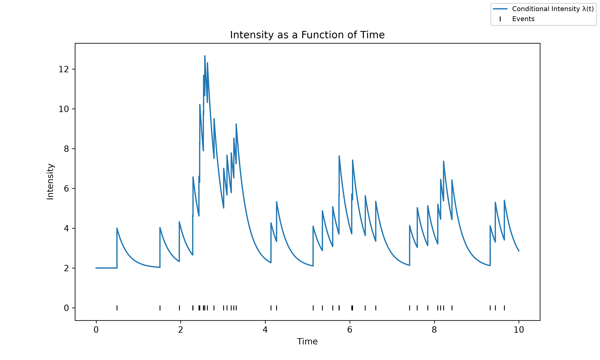
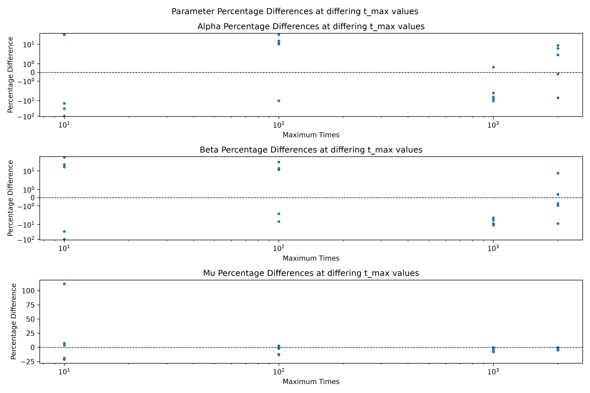
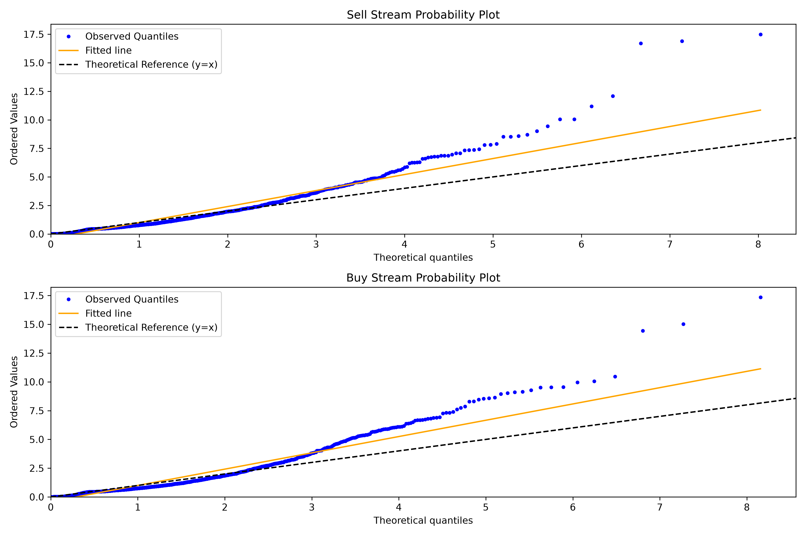
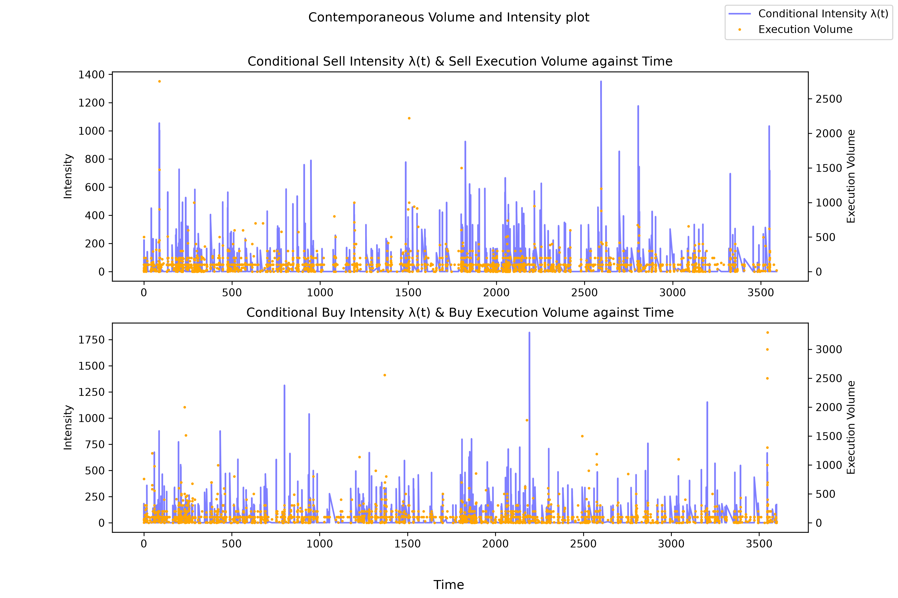

# Hawkes-Approach-to-NASDAQ-Trade-Flow

Using a bivariate, exponential kernel Hawkes process to model data from AAPL message book, ultimately comparing same and cross-side excitation, and evaluating contemporaneous and lagged execution volume to intensity relationship.

# Overview
The bivariate, exponential kernel Hawkes model uses 4 alpha values for the two types of same-side and cross-side excitations, a single beta value, and 2 mu values for sell and buy stream baseline event rates. The core findings of this project are: same-side excitation is far more dominant than cross-side excitation and past executions volumes have a more concrete influence on subsequent intensities rather than the reverse. 

# Data 
The data is accessed from: https://huggingface.co/datasets/totalorganfailure/lobster-data

Title of data: AAPL message book level 50

# Requirements
NumPy
SciPy
Matplotlib

# Results and Figures
Branching Ratios:
| Execution Type | Branching Ratio |
|----------------|-----------------|
| Sell to Sell | 0.434 |
| Buy to Sell | 0.031 |
| Buy to Buy | 0.445 |
| Sell to Buy| 0.028 |

Contemporaneous Execution Volume and Intensity Spearman Coefficient:
| Stream | Spearman coefficient | p-value |
|--------|----------------------|---------|
| Sell | -0.003 | 0.899 |
| Buy | -0.045 | 0.026 |

Lagged Execution Volume and Intensity Spearman Coefficient:
| Stream | Spearman coefficient | p-value |
|--------|----------------------|---------|
| Sell | 0.091 | 2.842e-5  |
| Buy | 0.078 | 1.145e-4 |

# Limitations
A limitation of the model used is volume having no influence on the process and the the use of a single timescale. A more in depth write-up of the theory, results, and analysis can be found here: 
